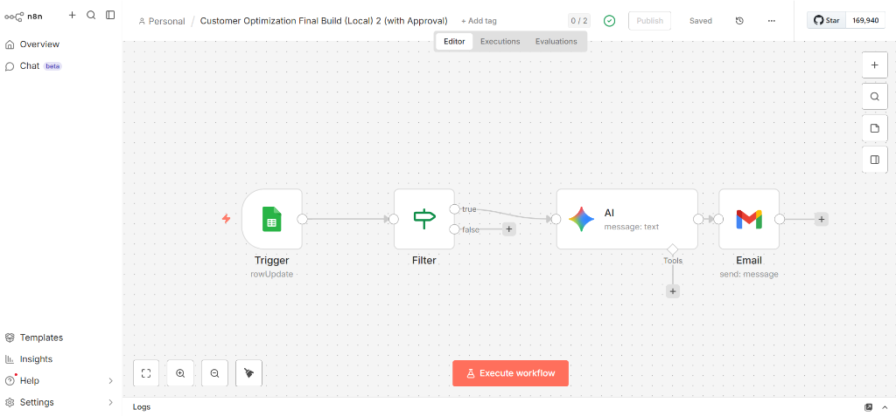

# Antigravity Agent로 만드는 n8n 자동화 워크플로우 Sample 프로젝트

## 📋 프로젝트 개요
Google Antigravity AI Agent와 n8n MCP를 활용한 이메일 자동화 시스템
- 이 프로젝트는 Google Sheets의 업데이트를 실시간으로 모니터링하고, Google Gemini AI를 활용하여 맞춤형 최적화 이메일을 자동으로 생성 및 발송하는 n8n 워크플로우 실습 프로젝트입니다.
- n8n 셀프호스트 + AI Coding Agent(Antigravity)로 n8n을 무료로 & 쉽게 사용하는 방식을 제안합니다. Claude Code로 작업해도 무방합니다.

### 주요 기능
- ✅ Google Sheets 실시간 트리거 (체크박스 기반)
- ✅ 조건부 필터링 (Boolean 타입 체크)
- ✅ Google Gemini AI 기반 이메일 본문 자동 생성
- ✅ Gmail 자동 발송
- ✅ 에러 핸들링 및 자동 복구

### 스크린샷

#### 워크플로우 전체 구조


*Google Sheets Trigger → Filter → AI (Gemini) → Email (Gmail) 순서로 연결된 워크플로우*


---

## 🛠️ 기술 스택

- **n8n**: 로컬 셀프 호스팅 (v1.x)
- **Google Antigravity AI Agent**: 워크플로우 설계 및 디버깅
- **n8n MCP (Model Context Protocol)**: AI Agent와 n8n 연동
- **Google Gemini API**: `gemini-3-flash-preview` 모델
- **Google Sheets API**: 트리거 및 데이터 소스
- **Gmail API**: 이메일 발송

---

## 📂 프로젝트 구조

```
n8n test/
├── .agent/
│   └── skills/
│       └── n8n-workflow-builder/
│           ├── SKILL.md              # n8n Workflow Builder Skill 정의
│           ├── config_guide.md       # 노드 설정 가이드
│           └── patterns.md           # 워크플로우 패턴 모음
├── AGENTS.md                         # AI Agent 운영 규칙
└── README.md                         # 프로젝트 문서 (본 파일)
```

---

## 🚀 설치 및 실행

### 1. 사전 요구사항
- Node.js (v18 이상)
- npm
- Google Cloud Platform 계정 (Sheets, Gmail, Gemini API 활성화)

### 2. n8n 설치
```bash
npm install -g n8n
```

### 3. n8n MCP 설치
```bash
npm install -g n8n-mcp
```

### 4. n8n 서버 시작
```bash
n8n start
```

서버가 시작되면 `http://localhost:5678`에서 접속 가능합니다.

### 5. MCP 서버 시작 (별도 터미널)
```bash
node "C:\Users\[사용자명]\AppData\Roaming\npm\node_modules\n8n-mcp\dist\mcp\index.js"
```

---

## 📝 작업 이력 (시간순)

### Phase 1: 환경 구성

#### 1.1 Antigravity 설치
- Angigravity 설치 및 구글 계정 로그인

#### 1.2 n8n 셀프 호스팅 요구사항 확인
- n8n 공식 문서 검토
- 로컬 환경에서 npm 기반 설치 방식 선택
- 외부 접속을 위한 터널링 옵션 검토 (localtunnel)

#### 1.3 n8n 설치 및 초기 설정
```bash
npm install -g n8n
n8n start
```
- 로컬 서버 정상 실행 확인 (`http://localhost:5678`)
- 외부 접속 URL 생성: `YOUR_URL`

#### 1.4 n8n MCP 연동
- n8n-mcp 패키지 설치
- MCP 서버 실행 및 Google Antigravity와 연동 확인
- 사용 가능한 MCP 도구 목록 확인:
  - `n8n_list_workflows`
  - `n8n_get_workflow`
  - `n8n_create_workflow`
  - `n8n_update_partial_workflow`
  - `n8n_validate_workflow`
  - `n8n_executions`
  - `n8n_autofix_workflow`
  - 기타 20+ 도구

---

### Phase 2: Agent Skill 개발

#### 2.1 n8n-workflow-builder Skill 생성
**파일**: `.agent/skills/n8n-workflow-builder/SKILL.md`

**핵심 기능 영역**:
1. 워크플로우 아키텍처 패턴 (AI Agent, HTTP, DB, Scheduling)
2. 노드 정밀 설정 (Parameters, Options, Credentials)
3. n8n 표현식 마스터 (`{{ $json.field }}`)
4. 코드 노드 활용 (JS/Python)
5. 검증 및 디버깅

#### 2.2 Agent 운영 규칙 정의
**파일**: `AGENTS.md`

**워크플로우 운영 3대 철칙 (The Iron Rule)**:
1. **무조건적 사후 검증 (Validation First)**
   - 모든 수정 후 `n8n_validate_workflow` 실행
   - `valid: true` 확인 후 보고

2. **런타임 로그 기반 진단 (Log-Based Diagnosis)**
   - 에러 발생 시 `n8n_executions` (mode="error") 실행
   - 노드명, 입력 데이터, 스택 트레이스 분석

3. **최신 규격 유지 (Best Practices)**
   - `n8n_autofix_workflow` 활용
   - 노드 버전 및 표현식 자동 업그레이드

#### 2.3 보조 문서 작성
- **config_guide.md**: 주요 노드(Trigger, Filter, AI, Email) 설정 가이드
- **patterns.md**: 재사용 가능한 워크플로우 패턴 모음

---

### Phase 3: 워크플로우 설계

#### 3.1 요구사항 분석
**목표**: Google Sheets의 액션을 기반으로 AI가 최적화 제안 이메일을 자동 생성 및 발송

**데이터 구조** (Google Sheets):
| 고객 | Health Check | Spending | Budget | 이메일 | Action |
|--------|--------------|----------|--------|--------|--------|
| 딜리셔스 | Red | 500,000 | 1,000,000 | test@example.com | ☑️ |

#### 3.2 워크플로우 아키텍처 설계
```
[Google Sheets Trigger] 
    → [Filter (IF)] 
    → [AI (Google Gemini)] 
    → [Email (Gmail)]
```

**노드별 역할**:
1. **Trigger**: Action 컬럼 변경 감지 (매 분마다 폴링)
2. **Filter**: Action = true인 행만 통과
3. **AI**: Gemini로 맞춤형 이메일 본문 생성
4. **Email**: Gmail로 발송

---

### Phase 4: 워크플로우 구현

#### 4.1 초기 워크플로우 생성
**워크플로우 ID**: `YOUR_WORKFLOW_ID`  
**워크플로우 이름**: `Customer Optimization Final Build (Local) 2`

#### 4.2 노드 설정

##### Trigger 노드 (Google Sheets Trigger)
```json
{
  "type": "n8n-nodes-base.googleSheetsTrigger",
  "typeVersion": 1,
  "parameters": {
    "documentId": "YOUR_SPREADSHEET_ID",
    "sheetName": "Sheet1",
    "event": "rowUpdate",
    "options": {
      "columnsToWatch": ["Action"]
    },
    "pollTimes": {
      "item": [{"mode": "everyMinute"}]
    }
  }
}
```

##### Filter 노드 (IF)
```json
{
  "type": "n8n-nodes-base.if",
  "typeVersion": 2.3,
  "parameters": {
    "conditions": {
      "combinator": "and",
      "conditions": [{
        "leftValue": "={{ $json.Action }}",
        "operator": {
          "type": "boolean",
          "operation": "true"
        }
      }]
    }
  }
}
```

##### AI 노드 (Google Gemini)
```json
{
  "type": "@n8n/n8n-nodes-langchain.googleGemini",
  "typeVersion": 1.1,
  "parameters": {
    "resource": "text",
    "modelId": "models/gemini-3-flash-preview",
    "options": {
      "simplify": true
    },
    "messages": {
      "values": [{
        "content": "\n\n위 데이터를 바탕으로 고객에게 보낼 광고 최적화 제안 이메일을 작성하세요.\n\n규칙:\n1. **순수 본문만 작성**: 제목, 서명 등 제외\n2. **마크다운 금지**: 코드 블록, 굵게 표시 등 금지\n3. **완성된 본문**: 실제 데이터를 사용하여 바로 보낼 수 있는 상태로 작성\n4. **어조**: 프로페셔널하고 친절한 한국어\n\n본문 내용:"
      }]
    }
  }
}
```

##### Email 노드 (Gmail)
```json
{
  "type": "n8n-nodes-base.gmail",
  "typeVersion": 2.2,
  "parameters": {
    "resource": "message",
    "operation": "send",
    "emailType": "text",
    "sendTo": "={{ $node.Filter.json.이메일 }}",
    "subject": "=[고객 알림] {{ $node.Filter.json.고객 }}님, 최적화 제안입니다.",
    "message": "={{ $json.text || $json.content.parts[0].text }}"
  }
}
```

---

### Phase 5: 디버깅 및 최적화

#### 5.1 주요 에러 및 해결

##### 에러 1: `Cannot read properties of undefined (reading 'execute')`
**원인**: AI 노드의 `resource`와 `operation` 불일치  
**해결**: `resource: "text"`, `operation: "message"` 설정

##### 에러 2: AI 출력에 `{{ }}` 변수 형태가 그대로 출력
**원인**: 프롬프트에 `=` 접두사 누락  
**해결**: 프롬프트 앞에 `=` 추가하여 표현식 모드 활성화

##### 에러 3: `invalid syntax` (표현식 파싱 오류)
**원인**: 
- 프롬프트 내 빈 `{{ }}` 기호
- Email 노드의 역슬래시 포함 표현식 (`$node[\"Filter\"]`)

**해결**: 
- 프롬프트에서 `{{ }}` 제거
- Dot Notation 사용 (`$node.Filter.json.이메일`)

##### 에러 4: `Wrong type: 'true' is a boolean but was expecting a string`
**원인**: Filter 노드에서 Boolean 값을 String과 비교  
**해결**: 연산자 타입을 `boolean`으로 변경, `operation: "true"` 사용

##### 에러 5: `Cannot read properties of undefined (reading 'trim')`
**원인**: Email 노드가 AI 출력 데이터를 찾지 못함  
**해결**: 유연한 데이터 경로 설정 (`$json.text || $json.content.parts[0].text`)

##### 에러 6: Email 노드 파라미터 초기화
**원인**: Partial Update 시 필수 파라미터 누락  
**해결**: `resource`, `operation`, `emailType` 명시적 재설정

#### 5.2 노드 버전 업그레이드
- **Filter 노드**: v2.2 → v2.3
- **Email 노드**: v2.1 → v2.2
- **자동화**: `n8n_autofix_workflow` 활용

#### 5.3 최종 검증
```bash
n8n_validate_workflow
```
**결과**: `valid: true`, 에러 0건, 경고 2건 (에러 핸들링 권장사항)

---

### Phase 6: 테스트 및 배포
1. Google Sheets에서 Action 체크박스 클릭
2. 트리거 정상 작동 확인
3. AI 이메일 본문 생성 확인
4. Gmail 발송 성공 확인

---

## 📚 참조 리소스

### 공식 문서
- [Antigravity 가이드](https://codelabs.developers.google.com/getting-started-google-antigravity)
- [n8n 공식 문서](https://docs.n8n.io/)
- [n8n Self-Hosting Guide](https://docs.n8n.io/hosting/)
- [n8n MCP GitHub](https://docs.n8n.io/advanced-ai/accessing-n8n-mcp-server/))
- [Google Gemini API 문서](https://ai.google.dev/docs)
- [Google Sheets API](https://developers.google.com/sheets/api)
- [Gmail API](https://developers.google.com/gmail/api)

### 프로젝트 내부 문서
- `.agent/skills/n8n-workflow-builder/SKILL.md` - n8n Workflow Builder Skill 정의
- `.agent/skills/n8n-workflow-builder/config_guide.md` - 노드 설정 가이드
- `.agent/skills/n8n-workflow-builder/patterns.md` - 워크플로우 패턴 모음
- `AGENTS.md` - AI Agent 운영 규칙 (3대 철칙)

### MCP 도구 목록
- `n8n_list_workflows` - 워크플로우 목록 조회
- `n8n_get_workflow` - 워크플로우 상세 조회
- `n8n_create_workflow` - 새 워크플로우 생성
- `n8n_update_partial_workflow` - 워크플로우 부분 수정
- `n8n_update_full_workflow` - 워크플로우 전체 수정
- `n8n_validate_workflow` - 워크플로우 유효성 검사
- `n8n_autofix_workflow` - 자동 오류 수정
- `n8n_executions` - 실행 로그 조회 및 분석
- `n8n_test_workflow` - 워크플로우 테스트 실행
- `search_nodes` - n8n 노드 검색
- `get_node` - 노드 상세 정보 조회
- `validate_node` - 노드 설정 검증
- `search_templates` - 워크플로우 템플릿 검색
- `get_template` - 템플릿 상세 조회
- `n8n_deploy_template` - 템플릿 배포

---

## 🎯 주요 학습 내용

### 1. n8n 표현식 시스템
- `=` 접두사: 표현식 모드 활성화 필수
- Dot Notation 권장: `$node.NodeName.json.field`
- 역슬래시 회피: `$node[\"Name\"]` 대신 `$node.Name` 사용

### 2. 데이터 타입 엄격성
- Boolean vs String 구분 필수
- Google Sheets 체크박스 = Boolean 타입
- 타입 불일치 시 명시적 변환 또는 연산자 변경

### 3. AI 노드 최적화
- `simplify: true` 옵션으로 출력 구조 단순화
- 프롬프트에 명확한 출력 규칙 명시
- 마크다운 금지, 순수 텍스트 출력 강제

### 4. 에러 핸들링 전략
- 사후 검증 필수 (`validate_workflow`)
- 실행 로그 정밀 분석 (`executions` mode="error")
- 자동 수정 도구 활용 (`autofix_workflow`)

### 5. Partial Update 주의사항
- 필수 파라미터 누락 방지
- 전체 워크플로우 조회 후 수정 권장
- 업데이트 후 즉시 검증

---

## 🔧 트러블슈팅

### Q1. 워크플로우가 트리거되지 않아요
**A**: Google Sheets Trigger 노드 설정 확인
1. n8n UI에서 Document와 Sheet를 수동으로 재선택
2. `event: "rowUpdate"` 설정 확인
3. `columnsToWatch: ["Action"]` 설정 확인
4. 워크플로우 `Active` 상태 확인

### Q2. AI가 이상한 텍스트를 생성해요
**A**: 프롬프트 최적화
1. 프롬프트 앞에 `=` 접두사 추가
2. 출력 규칙 명확히 명시 (마크다운 금지, 순수 본문만)
3. 모델 변경 고려

### Q3. `invalid syntax` 에러가 발생해요
**A**: 표현식 문법 점검
1. 빈 `{{ }}` 제거
2. 역슬래시 제거, Dot Notation 사용
3. `n8n_validate_workflow` 실행

### Q4. Email 노드에서 본문이 비어요
**A**: 데이터 경로 확인
1. AI 노드 출력 구조 확인 (`simplify` 옵션)
2. 유연한 경로 사용: `$json.text || $json.content.parts[0].text`
3. 실행 로그에서 AI 노드 출력 데이터 확인

---

## 🚀 향후 개선 계획

- [ ] 에러 핸들링 노드 추가 (Error Trigger)
- [ ] 워크플로우 실행 알림 (Slack 연동)
- [ ] AI 모델 A/B 테스트 (`gemini-1.5-flash` vs `gemini-3-flash-preview`)
- [ ] 이메일 템플릿 다양화 (HTML 지원)
- [ ] 배치 처리 (여러 행 동시 처리)
- [ ] 성과 대시보드 연동

---

## 👥 기여자

- **JINSOO HWANG** - 프로젝트 설계 및 구현
- **Google Antigravity AI Agent** - 워크플로우 디버깅 및 최적화

---

## 📄 라이선스

이 프로젝트는 개인 학습 및 연구 목적으로 제작되었습니다.

---

## 📞 문의

프로젝트 관련 문의사항은 GitHub Issues를 통해 남겨주세요.

---

**마지막 업데이트**: 2026-01-20 
